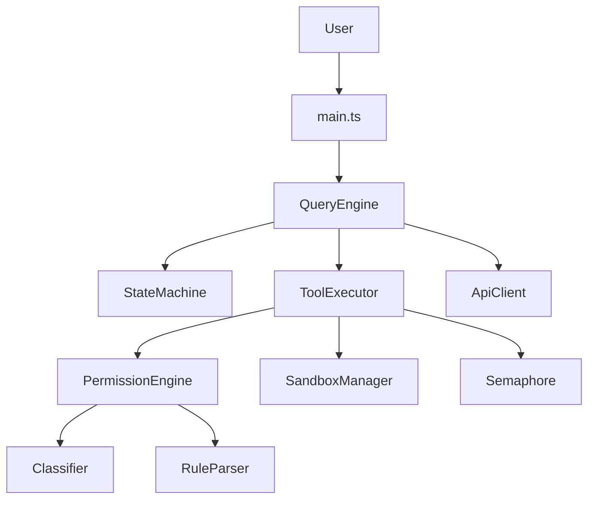
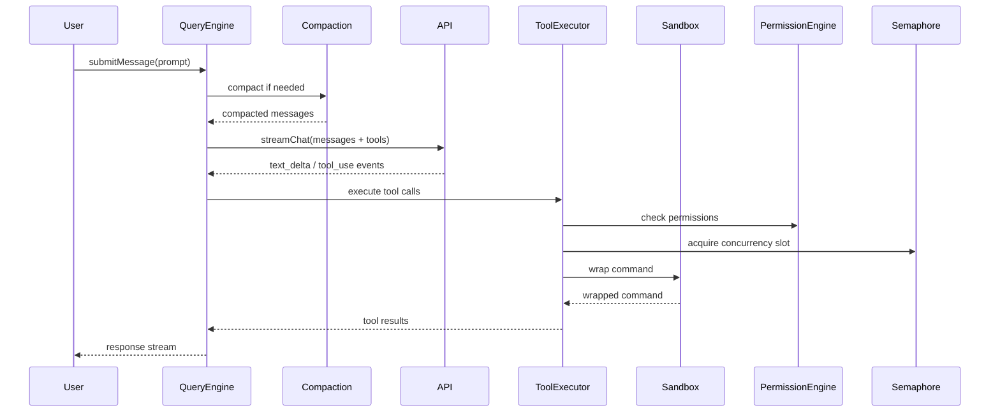

# KC-CLI Architecture

**Version**: 3.2.0 | **Language**: TypeScript (ESM, strict mode) | **Date**: 2026-05-31

## System Overview

KC-CLI is an AI-powered CLI agent system for software development. It uses a state machine pattern to manage the full query lifecycle from user input through LLM interaction to tool execution. Architecture patterns are derived from comparative analysis of PilotDeck (OpenBMB) and pi (earendil-works) projects.

## Core Architecture



## Module Structure

```
src/
├── main.ts              # Entry point: CLI parsing, REPL, MCP init, /branch /checkout /history commands
├── query/               # Core query engine
│   ├── QueryEngine.ts           # State machine with steering support (steer/followUp queues)
│   ├── QueryEngineState.ts      # Conversation state backed by SessionTree
│   ├── QueryEngineCompaction.ts # Tiered compaction engine iteration
│   ├── QueryEngineMemory.ts     # Memory integration management
│   ├── QueryEngineError.ts      # Circuit breakers, retry state, KCError classification
│   └── protocol.ts              # QueryEngine public types
├── executors/
│   └── toolExecutor.ts  # Three-phase pipeline: prepare→execute→finalize
├── permissions/
│   ├── engine.ts        # 6-step deny-first + plugin-contributed rules (Step 1.5)
│   ├── classifier.ts    # Auto mode: fast-path + LLM classification
│   ├── ruleParser.ts    # Enhanced YAML rules with conditions
│   ├── rules.ts         # Pattern matching and rule management
│   ├── protectedPaths.ts # Bypass-immune protected paths
│   └── protocol.ts      # Permission types
├── tools/               # 21 built-in tools with optional prepare/finalize methods
│   ├── registry.ts      # Dynamic tool discovery with priority-based loading
│   └── protocol.ts      # ToolDefinition, ToolUseContext (with ExecutionEnv), ToolResult
├── api/                 # LLM API clients (Anthropic, OpenAI, Ollama, Qwen, GLM, DeepSeek)
│   └── protocol.ts      # LLMStreamEvent (9 types), TokenUsage, LLMRequestConfig
├── services/
│   ├── sandbox.ts       # Sandbox manager (bubblewrap/seccomp/docker/noop)
│   ├── budget.ts        # BudgetEnforcer: per-session/turn/tool-result token limits
│   ├── execution-env.ts # ExecutionEnv interface (FileSystem + Shell)
│   ├── execution-env-local.ts  # LocalExecutionEnv wrapping fs/child_process
│   ├── execution-env-mock.ts   # MockExecutionEnv for testing
│   ├── compaction/      # Tiered compaction engines
│   │   ├── types.ts            # CompactionEngine interface
│   │   ├── cached-micro.ts     # Priority 0: hash-cached microcompact
│   │   ├── snip.ts             # Priority 10: targeted large-output truncation
│   │   ├── full.ts             # Priority 20: LLM-based summarization
│   │   └── force.ts            # Priority 30: last-resort truncation
│   └── logger.ts        # Structured logging with sensitive field redaction
├── plugins/             # Contribution-based plugin system
│   ├── types.ts         # Plugin, PluginHooks (preTurn/preToolUse/postToolUse/postTurn/onError)
│   ├── plugin-manager.ts # Hook chaining, permission rule collection
│   ├── plugin-loader.ts # Plugin discovery and validation
│   └── protocol.ts      # Plugin types
├── state/               # Observable state store and session management
│   ├── store.ts         # ObservableStateStore with budget tracking
│   ├── machine.ts       # AgentStateMachine with validated transitions
│   ├── session-tree.ts  # SessionTree: branching, checkout, merge, serialization
│   └── protocol.ts      # AgentState, AgentEvent types
├── orchestrator/        # Multi-agent coordination
│   ├── agent-orchestrator.ts # Spawn, batch, waitForAll with budget enforcement
│   ├── event-bus.ts     # Pub/sub with scoped buses and async iterators
│   ├── permission-cascader.ts # Child permission derivation
│   ├── backends/in-process.ts # AsyncLocalStorage isolation
│   └── protocol.ts      # SubAgent types
├── memory/              # File-based persistent memory
│   └── protocol.ts      # MemoryEntry, MemoryService types
├── types/               # Re-export barrels (backward compatibility)
│   ├── result.ts        # Result<T,E> sum type with ok/err/mapResult/flatMap/unwrapOr
│   ├── errors.ts        # KCError with 18 ErrorCode values + fromApiError factory
│   ├── message.ts       # Re-export from query/protocol
│   ├── tools.ts         # Re-export from tools/protocol
│   └── permissions.ts   # Re-export from permissions/protocol
├── commands/
│   └── branch.ts        # /branch, /checkout, /history CLI commands
├── utils/
│   ├── semaphore.ts     # Async concurrency control
│   └── errorHandling.ts # Unified error handling patterns
├── metrics/
│   └── cacheMetrics.ts  # Cache hit rate monitoring
├── ui/                  # Terminal UI
│   ├── components/InputBox.ts # Steer mode support (Ctrl+I toggle)
│   └── keypress.ts      # isSteerKey() helper
├── lsp/                 # Language server integration
├── mcp/                 # Model Context Protocol client
└── acp/                 # Agent Communication Protocol server
```

## Data Flow: User Input → Response



## Permission Flow (6-Step)

1. Check global deny rules (alwaysDenyRules)
2. Tool-specific permission check (tool.checkPermissions)
3. Security-critical path check (protectedPaths - bypass-immune)
4. Bypass permission mode (if enabled)
5. Check global allow rules (alwaysAllowRules)
6. Default based on mode (dontAsk/auto/plan/default)

## Sandbox Security

- **Marker + HMAC**: Command input is marked with a string key (`__sandboxWrapped`) and HMAC-signed to prevent forgery
- **Backend chain**: bubblewrap → seccomp → docker → noop (with configurable `failIfNoSandbox`)
- **Per-tool policy**: Each tool has enforcement levels: required, preferred, optional, excluded

## Concurrency Model

- Parallel tool execution with `Promise.all`
- Semaphore-based concurrency limiting (default: 5 concurrent)
- FIFO ordering for waiting tool executions
- Automatic permit release on error

## Compaction Strategy

Four-tier approach with priority-based engine selection:
1. **CachedMicrocompact** (priority 0): Hash-cached microcompact results, no LLM
2. **Snip** (priority 10): Targeted removal of large tool outputs (>5000 chars)
3. **Full compact** (priority 20): LLM-based summarization with retry
4. **Force truncate** (priority 30): Last-resort absolute token limit

Engines are iterated by priority; chaining occurs when an engine reduces tokens but not enough.

## Error Handling

Unified `Result<T,E>` sum type for explicit error propagation:
- `ok(value)` / `err(error)` constructors
- `isOk()` / `isErr()` type guards
- `mapResult()` / `flatMap()` for chaining
- `unwrapOr()` for defaults

`KCError` class with 18 stable error codes: `api_rate_limit`, `api_auth_failed`, `tool_timeout`, `budget_exceeded`, `sandbox_denied`, etc.

## Plugin System

Contribution-based architecture with 5 contribution types:
- **tools**: Custom tool definitions
- **hooks**: `preTurn`, `preToolUse`, `postToolUse`, `postTurn`, `onError`
- **permissionRules**: Declarative allow/deny/ask rules with priority
- **prompts**: Named prompt templates with arguments
- **mcpServers**: MCP server integrations

## Session Tree

Non-linear conversation model with branching:
- `branch()`: Fork conversation at current point
- `checkout(nodeId)`: Switch to a different branch
- `merge(fromNodeId)`: Merge branch into parent
- `prune(nodeId)`: Delete branch and descendants
- CLI commands: `/branch`, `/checkout <id>`, `/history`

## Steering System

Dual-queue message injection during execution:
- `steer(message)`: Inject message between tool execution phases (mid-turn redirection)
- `followUp(message)`: Inject message after turn completion (implicit new turn)
- `Ctrl+I`: Toggle steer mode in UI

## ExecutionEnv Abstraction

Swappable runtime backends for tool isolation:
- `FileSystem`: readFile, writeFile, exists, stat, glob, mkdir, rm
- `Shell`: exec with cwd/env/timeout/signal support
- `LocalExecutionEnv`: Wraps Node.js fs/child_process
- `MockExecutionEnv`: In-memory for testing

## Budget Enforcement

Proactive token budget management:
- Per-session token limit
- Per-turn token limit
- Per-tool-result token limit
- Per-sub-agent token limit
- USD cost limit
- Opt-in via `BudgetConfig`

## Key Design Decisions

| Decision | Rationale |
|----------|-----------|
| State machine pattern | Predictable lifecycle, easy to reason about |
| Deny-first permissions | Security by default |
| Prompt caching (byte-stable prefix) | Reduces API costs by 50%+ |
| Co-located tests (*.test.ts) | Tests live next to implementation |
| Zod input schemas | Runtime validation + TypeScript types |
| Protocol-first modules | Clean interface boundaries, eliminates circular imports |
| Result<T,E> pattern | Explicit error handling, no uncaught exceptions |
| Tiered compaction | Efficient context management with caching |
| Two-phase tool execution | Clean separation of concerns (prepare/execute/finalize) |
| Session tree branching | Non-linear conversations, undo, forking |
| ExecutionEnv abstraction | Testable tools, swappable backends |
